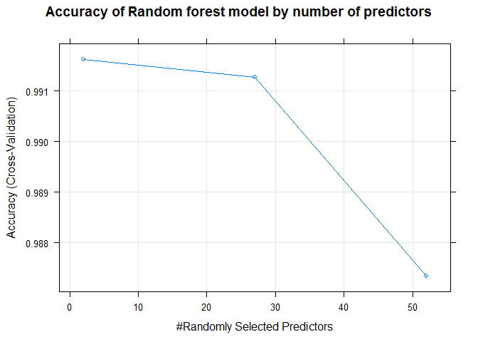

## Executive summary
In this report we are using data from accelerometers on the belt, forearm, arm, and dumbell of 6 participants. They were asked to perform barbell lifts correctly and incorrectly in 5 different ways (this information is contained in the classe variable). 
The data are collected using devices such as Jawbone Up, Nike FuelBand, and Fitbit.
More information about this database is available from the website [here](
http://web.archive.org/web/20161224072740/http:/groupware.les.inf.puc-rio.br/har) (see the section on the Weight Lifting Exercise Dataset).

We fitted three differen models:

- Random Forest 
- Linear Discriminant Analysis
- Support Vector Machine

Among the tested models the one with the greatest accuracy is Random Forest, and we use this model to predict the correct way the exercise is performed (classe variable) in the validation set of data.

## Load Data
First we have to load data and the necessary library for the study

```r
#check package
list.of.packages <- c("ggplot2","lattice","caret",
                      "parallel","doParallel","e1071")
new.packages <- list.of.packages[!(list.of.packages %in% installed.packages()[,"Package"])]
if(length(new.packages)) install.packages(new.packages)

library(ggplot2);library(lattice);library(caret);
library(parallel);library(doParallel);library("e1071")

#load data
dataTrain <- read.csv(url("https://d396qusza40orc.cloudfront.net/predmachlearn/pml-training.csv"),header=TRUE)
#validation data set
validation <- read.csv(url("https://d396qusza40orc.cloudfront.net/predmachlearn/pml-testing.csv"),header=TRUE)
```

## Exploratory analysis

```r
str(dataTrain)
```

```
## 'data.frame':	19622 obs. of  160 variables:
##  $ X                       : int  1 2 3 4 5 6 7 8 9 10 ...
##  $ user_name               : Factor w/ 6 levels "adelmo","carlitos",..: 2 2 2 2 2 2 2 2 2 2 ...
##  $ raw_timestamp_part_1    : int  1323084231 1323084231 1323084231 1323084232 1323084232 1323084232 1323084232 1323084232 1323084232 1323084232 ...
##  $ raw_timestamp_part_2    : int  788290 808298 820366 120339 196328 304277 368296 440390 484323 484434 ...
##  $ cvtd_timestamp          : Factor w/ 20 levels "02/12/2011 13:32",..: 9 9 9 9 9 9 9 9 9 9 ...
##  $ new_window              : Factor w/ 2 levels "no","yes": 1 1 1 1 1 1 1 1 1 1 ...
##  $ num_window              : int  11 11 11 12 12 12 12 12 12 12 ...
##  $ roll_belt               : num  1.41 1.41 1.42 1.48 1.48 1.45 1.42 1.42 1.43 1.45 ...
##  $ pitch_belt              : num  8.07 8.07 8.07 8.05 8.07 8.06 8.09 8.13 8.16 8.17 ...
##  $ yaw_belt                : num  -94.4 -94.4 -94.4 -94.4 -94.4 -94.4 -94.4 -94.4 -94.4 -94.4 ...
##  $ total_accel_belt        : int  3 3 3 3 3 3 3 3 3 3 ...
##  $ kurtosis_roll_belt      : Factor w/ 397 levels "","-0.016850",..: 1 1 1 1 1 1 1 1 1 1 ...
##  $ kurtosis_picth_belt     : Factor w/ 317 levels "","-0.021887",..: 1 1 1 1 1 1 1 1 1 1 ...
##  $ kurtosis_yaw_belt       : Factor w/ 2 levels "","#DIV/0!": 1 1 1 1 1 1 1 1 1 1 ...
##  $ skewness_roll_belt      : Factor w/ 395 levels "","-0.003095",..: 1 1 1 1 1 1 1 1 1 1 ...
##  $ skewness_roll_belt.1    : Factor w/ 338 levels "","-0.005928",..: 1 1 1 1 1 1 1 1 1 1 ...
##  $ skewness_yaw_belt       : Factor w/ 2 levels "","#DIV/0!": 1 1 1 1 1 1 1 1 1 1 ...
##  $ max_roll_belt           : num  NA NA NA NA NA NA NA NA NA NA ...
##  $ max_picth_belt          : int  NA NA NA NA NA NA NA NA NA NA ...
##  $ max_yaw_belt            : Factor w/ 68 levels "","-0.1","-0.2",..: 1 1 1 1 1 1 1 1 1 1 ...
##  $ min_roll_belt           : num  NA NA NA NA NA NA NA NA NA NA ...
##  $ min_pitch_belt          : int  NA NA NA NA NA NA NA NA NA NA ...
##  $ min_yaw_belt            : Factor w/ 68 levels "","-0.1","-0.2",..: 1 1 1 1 1 1 1 1 1 1 ...
##  $ amplitude_roll_belt     : num  NA NA NA NA NA NA NA NA NA NA ...
##  $ amplitude_pitch_belt    : int  NA NA NA NA NA NA NA NA NA NA ...
##  $ amplitude_yaw_belt      : Factor w/ 4 levels "","#DIV/0!","0.00",..: 1 1 1 1 1 1 1 1 1 1 ...
##  $ var_total_accel_belt    : num  NA NA NA NA NA NA NA NA NA NA ...
##  $ avg_roll_belt           : num  NA NA NA NA NA NA NA NA NA NA ...
##  $ stddev_roll_belt        : num  NA NA NA NA NA NA NA NA NA NA ...
##  $ var_roll_belt           : num  NA NA NA NA NA NA NA NA NA NA ...
##  $ avg_pitch_belt          : num  NA NA NA NA NA NA NA NA NA NA ...
##  $ stddev_pitch_belt       : num  NA NA NA NA NA NA NA NA NA NA ...
##  $ var_pitch_belt          : num  NA NA NA NA NA NA NA NA NA NA ...
##  $ avg_yaw_belt            : num  NA NA NA NA NA NA NA NA NA NA ...
##  $ stddev_yaw_belt         : num  NA NA NA NA NA NA NA NA NA NA ...
##  $ var_yaw_belt            : num  NA NA NA NA NA NA NA NA NA NA ...
##  $ gyros_belt_x            : num  0 0.02 0 0.02 0.02 0.02 0.02 0.02 0.02 0.03 ...
##  $ gyros_belt_y            : num  0 0 0 0 0.02 0 0 0 0 0 ...
##  $ gyros_belt_z            : num  -0.02 -0.02 -0.02 -0.03 -0.02 -0.02 -0.02 -0.02 -0.02 0 ...
##  $ accel_belt_x            : int  -21 -22 -20 -22 -21 -21 -22 -22 -20 -21 ...
##  $ accel_belt_y            : int  4 4 5 3 2 4 3 4 2 4 ...
##  $ accel_belt_z            : int  22 22 23 21 24 21 21 21 24 22 ...
##  $ magnet_belt_x           : int  -3 -7 -2 -6 -6 0 -4 -2 1 -3 ...
##  $ magnet_belt_y           : int  599 608 600 604 600 603 599 603 602 609 ...
##  $ magnet_belt_z           : int  -313 -311 -305 -310 -302 -312 -311 -313 -312 -308 ...
##  $ roll_arm                : num  -128 -128 -128 -128 -128 -128 -128 -128 -128 -128 ...
##  $ pitch_arm               : num  22.5 22.5 22.5 22.1 22.1 22 21.9 21.8 21.7 21.6 ...
##  $ yaw_arm                 : num  -161 -161 -161 -161 -161 -161 -161 -161 -161 -161 ...
##  $ total_accel_arm         : int  34 34 34 34 34 34 34 34 34 34 ...
##  $ var_accel_arm           : num  NA NA NA NA NA NA NA NA NA NA ...
##  $ avg_roll_arm            : num  NA NA NA NA NA NA NA NA NA NA ...
##  $ stddev_roll_arm         : num  NA NA NA NA NA NA NA NA NA NA ...
##  $ var_roll_arm            : num  NA NA NA NA NA NA NA NA NA NA ...
##  $ avg_pitch_arm           : num  NA NA NA NA NA NA NA NA NA NA ...
##  $ stddev_pitch_arm        : num  NA NA NA NA NA NA NA NA NA NA ...
##  $ var_pitch_arm           : num  NA NA NA NA NA NA NA NA NA NA ...
##  $ avg_yaw_arm             : num  NA NA NA NA NA NA NA NA NA NA ...
##  $ stddev_yaw_arm          : num  NA NA NA NA NA NA NA NA NA NA ...
##  $ var_yaw_arm             : num  NA NA NA NA NA NA NA NA NA NA ...
##  $ gyros_arm_x             : num  0 0.02 0.02 0.02 0 0.02 0 0.02 0.02 0.02 ...
##  $ gyros_arm_y             : num  0 -0.02 -0.02 -0.03 -0.03 -0.03 -0.03 -0.02 -0.03 -0.03 ...
##  $ gyros_arm_z             : num  -0.02 -0.02 -0.02 0.02 0 0 0 0 -0.02 -0.02 ...
##  $ accel_arm_x             : int  -288 -290 -289 -289 -289 -289 -289 -289 -288 -288 ...
##  $ accel_arm_y             : int  109 110 110 111 111 111 111 111 109 110 ...
##  $ accel_arm_z             : int  -123 -125 -126 -123 -123 -122 -125 -124 -122 -124 ...
##  $ magnet_arm_x            : int  -368 -369 -368 -372 -374 -369 -373 -372 -369 -376 ...
##  $ magnet_arm_y            : int  337 337 344 344 337 342 336 338 341 334 ...
##  $ magnet_arm_z            : int  516 513 513 512 506 513 509 510 518 516 ...
##  $ kurtosis_roll_arm       : Factor w/ 330 levels "","-0.02438",..: 1 1 1 1 1 1 1 1 1 1 ...
##  $ kurtosis_picth_arm      : Factor w/ 328 levels "","-0.00484",..: 1 1 1 1 1 1 1 1 1 1 ...
##  $ kurtosis_yaw_arm        : Factor w/ 395 levels "","-0.01548",..: 1 1 1 1 1 1 1 1 1 1 ...
##  $ skewness_roll_arm       : Factor w/ 331 levels "","-0.00051",..: 1 1 1 1 1 1 1 1 1 1 ...
##  $ skewness_pitch_arm      : Factor w/ 328 levels "","-0.00184",..: 1 1 1 1 1 1 1 1 1 1 ...
##  $ skewness_yaw_arm        : Factor w/ 395 levels "","-0.00311",..: 1 1 1 1 1 1 1 1 1 1 ...
##  $ max_roll_arm            : num  NA NA NA NA NA NA NA NA NA NA ...
##  $ max_picth_arm           : num  NA NA NA NA NA NA NA NA NA NA ...
##  $ max_yaw_arm             : int  NA NA NA NA NA NA NA NA NA NA ...
##  $ min_roll_arm            : num  NA NA NA NA NA NA NA NA NA NA ...
##  $ min_pitch_arm           : num  NA NA NA NA NA NA NA NA NA NA ...
##  $ min_yaw_arm             : int  NA NA NA NA NA NA NA NA NA NA ...
##  $ amplitude_roll_arm      : num  NA NA NA NA NA NA NA NA NA NA ...
##  $ amplitude_pitch_arm     : num  NA NA NA NA NA NA NA NA NA NA ...
##  $ amplitude_yaw_arm       : int  NA NA NA NA NA NA NA NA NA NA ...
##  $ roll_dumbbell           : num  13.1 13.1 12.9 13.4 13.4 ...
##  $ pitch_dumbbell          : num  -70.5 -70.6 -70.3 -70.4 -70.4 ...
##  $ yaw_dumbbell            : num  -84.9 -84.7 -85.1 -84.9 -84.9 ...
##  $ kurtosis_roll_dumbbell  : Factor w/ 398 levels "","-0.0035","-0.0073",..: 1 1 1 1 1 1 1 1 1 1 ...
##  $ kurtosis_picth_dumbbell : Factor w/ 401 levels "","-0.0163","-0.0233",..: 1 1 1 1 1 1 1 1 1 1 ...
##  $ kurtosis_yaw_dumbbell   : Factor w/ 2 levels "","#DIV/0!": 1 1 1 1 1 1 1 1 1 1 ...
##  $ skewness_roll_dumbbell  : Factor w/ 401 levels "","-0.0082","-0.0096",..: 1 1 1 1 1 1 1 1 1 1 ...
##  $ skewness_pitch_dumbbell : Factor w/ 402 levels "","-0.0053","-0.0084",..: 1 1 1 1 1 1 1 1 1 1 ...
##  $ skewness_yaw_dumbbell   : Factor w/ 2 levels "","#DIV/0!": 1 1 1 1 1 1 1 1 1 1 ...
##  $ max_roll_dumbbell       : num  NA NA NA NA NA NA NA NA NA NA ...
##  $ max_picth_dumbbell      : num  NA NA NA NA NA NA NA NA NA NA ...
##  $ max_yaw_dumbbell        : Factor w/ 73 levels "","-0.1","-0.2",..: 1 1 1 1 1 1 1 1 1 1 ...
##  $ min_roll_dumbbell       : num  NA NA NA NA NA NA NA NA NA NA ...
##  $ min_pitch_dumbbell      : num  NA NA NA NA NA NA NA NA NA NA ...
##  $ min_yaw_dumbbell        : Factor w/ 73 levels "","-0.1","-0.2",..: 1 1 1 1 1 1 1 1 1 1 ...
##  $ amplitude_roll_dumbbell : num  NA NA NA NA NA NA NA NA NA NA ...
##   [list output truncated]
```

```r
dim(dataTrain)
```

```
## [1] 19622   160
```

```r
dim(validation)
```

```
## [1]  20 160
```

The training data set is made of 19622 observations on 160 columns, but we can notice that many columns have NA values or blank values on almost every observation; so we will remove them, because they will not produce any information. Moreover the first seven columns give information about the people who did the test, and also timestamps; so we can remove also this columns.


```r
# Here we get the indexes of the columns having at least 90% of NA or blank values on the training dataset
indColToRemove <- which(colSums(is.na(dataTrain)|dataTrain=="")>0.9*dim(dataTrain)[1]) 
dataTrainClean <- dataTrain[,-indColToRemove]
dataTrainClean <- dataTrainClean[,-c(1:7)]
dim(dataTrainClean)
```

```
## [1] 19622    53
```

```r
#near zero variation
NZV <- nearZeroVar(dataTrainClean)
length(NZV)
```

```
## [1] 0
```

There are no other variable to eliminate from the data. So now we have only 53 columns in our dataset.
Have a look at the distribution of the target variable in the dataset.


```r
plot(dataTrainClean$classe, col="blue",
      xlab="classe", ylab="Frequency",
      main = "Number of events for different exercices")
```

<!-- -->

##Cross Validation - Splitting data
We will use the validation set only at the and of the analysis, so we have to split the dataTrain into two different sample: 70% as train data and 30% as test data.

We will use test data to checks accurancy and to test overfitting.


```r
# create training & testing data sets
set.seed(555)
inTrain <- createDataPartition(y=dataTrainClean$classe, p=0.7, list=FALSE) 
train <- dataTrainClean[inTrain,]; test <- dataTrainClean[-inTrain,]
```

##Train models
We want to train 3 different model, a Linear Discriminant Analysis, Support Vector Machine and a Random Forset.

To improove accurancy in a new set of data and to prevent overfitting, we will use a trainControl() with a k-fold cross-validation (with k=5).

Now we can train our model on the train set of data and then we test the accurancy on test data using the confusion matrix.

To reduce model training times, it's possible to configure parallel processing. This step is especially important for the random foreset which requires long training times when using a cross validation method.


```r
# set up training run for x / y syntax because model format performs poorly
x <- train[,-53]
y <- train[,53]
#Configure parallel processing
cluster <- makeCluster(detectCores() - 1) # convention to leave 1 core for OS
registerDoParallel(cluster)

#Configure trainControl object for k-fold cross-validation
fitControl <- trainControl(method = "cv",
                           number = 5,
                           allowParallel = TRUE)

#random forest
modRF <- train(x,y,data=train,method="rf",trControl = fitControl)

#LInad Discriminant Analysis
modLDA <- train(x,y, data=train, method="lda", trControl = fitControl)

#Support Vector Machine
modSVM<- svm(classe~., data=train, trControl = fitControl)

#De-register parallel processing cluster
stopCluster(cluster)
registerDoSEQ()
```

To validate the models we can check accurancy from the confusion matrix both in the train and test set

```r
#accurancy in train set
matrixRF <- confusionMatrix(modRF$finalModel$predicted,train$classe)
predLDA <- predict(modLDA,train)
matrixLDA <- confusionMatrix(predLDA , train$classe)
matrixSVM <- confusionMatrix(modSVM$fitted, train$classe)

AccurancyTrain <- c(round(matrixRF$overall['Accuracy'],3),
                    round(matrixSVM$overall['Accuracy'],3),
                    round(matrixLDA$overall['Accuracy'],3))

#accurancy in trest set
predRF <- predict(modRF,test)
predSVM <- predict(modSVM,test)
predLDA <- predict(modLDA,test)

AccurancyTest <- c(round(confusionMatrix(predRF,test$classe)$overall['Accuracy'],3),
                   round(confusionMatrix(predSVM,test$classe)$overall['Accuracy'],3),
                   round(confusionMatrix(predLDA,test$classe)$overall['Accuracy'],3))

Accurancy <- data.frame(AccurancyTrain, AccurancyTest)
rownames(Accurancy) <- c("Random Forest", "Linear Discriminant Analysis", "Support Vector Machine")
Accurancy
```

```
##                              AccurancyTrain AccurancyTest
## Random Forest                         0.994         0.993
## Linear Discriminant Analysis          0.959         0.948
## Support Vector Machine                0.706         0.707
```

By comparing the accuracy rate values of the three models, the best model is Random Forest. Have a look at this model and see the importance of predictors.


```r
plot(modRF, main="Accuracy of Random forest model by number of predictors")
```

<!-- -->

```r
# Compute the variable importance 
MostImpVars <- varImp(modRF)
MostImpVars
```

```
## rf variable importance
## 
##   only 20 most important variables shown (out of 52)
## 
##                   Overall
## roll_belt          100.00
## yaw_belt            77.64
## magnet_dumbbell_z   67.46
## pitch_belt          65.21
## magnet_dumbbell_y   62.27
## magnet_dumbbell_x   54.26
## pitch_forearm       54.13
## roll_forearm        51.89
## accel_dumbbell_y    45.11
## magnet_belt_z       43.49
## accel_belt_z        41.17
## magnet_belt_y       40.89
## roll_dumbbell       40.47
## accel_dumbbell_z    37.24
## roll_arm            34.22
## accel_forearm_x     30.92
## gyros_belt_z        29.90
## yaw_dumbbell        29.18
## gyros_dumbbell_y    28.39
## accel_dumbbell_x    28.35
```

##Conclusion
Among the trained models, the Random Forest turned out to be the one with the highest accuracy, so we use this model to predict the result in the validation set.


```r
Results <- predict(modRF, validation)
Results
```

```
##  [1] B A B A A E D B A A B C B A E E A B B B
## Levels: A B C D E
```
